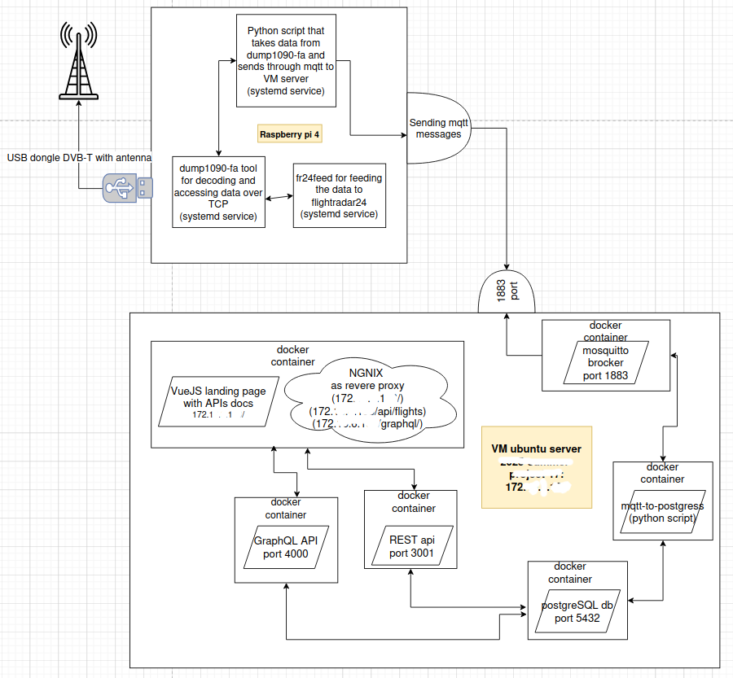

# TAMK FlightRadar - Real-Time Flight Tracking System

[](#technology-stack)
[](#architecture)
[](#deployment)

TAMK FlightRadar is a **production-ready, real-time flight tracking system** that demonstrates **IoT data real-time data ingestion**, storage, and retrieval using a Raspberry Pi, an ADS-B USB dongle with antenna, and **modern cloud-native technologies**. The system collects live aircraft data via the MQTT protocol, stores it in a PostgreSQL database, and exposes a RESTful API & GraphQL API for querying and analyzing flight information. The entire solution is **containerized using Docker**, supporting robust message brokering through Mosquitto MQTT and reverse proxy routing with NGINX.

## Project diagram



<!-- ## Project Components

1. Raspberry Pi 4 (fr24feed & dump1090-fa) with mqtt publisher script as systemd service.
2. Mosquitto MQTT Broker (Docker container)
3. MQTT Subscriber (Python script using paho-mqtt and psycopg2)
4. PostgreSQL Database with indexed schema
5. REST API developed in Node.js with Express
6. GraphQL API in Node.js with Apollo
7. NGINX as reverse Proxy
8. Docker for containerisation and orchestration -->

## Technologies Used

### **Backend & APIs**
- **Node.js** with **Express.js** - RESTful API
- **GraphQL** with **Apollo Server** - GraphQL API
- **Python** - Scripting: IoT data processing and MQTT
- **PostgreSQL** - Popular database with advanced indexing
- **MQTT** (Mosquitto) - IoT message broker for real-time communication

### **DevOps & Infrastructure**
- **Docker** & **Docker Compose** - Containerization and orchestration
- **NGINX** - Reverse proxy
- **Linux** (Ubuntu 22.04 LTS, Raspbian) - Server administration
- **Systemd** - Service management and automation

### **Hardware & IoT**
- **Raspberry Pi 4** - IoT computing device
- **Jetvision ADS-B USB Dongle & A3 antenna** - Radio frequency data collection
- **dump1090-fa** - Software for radio signal processing
- **fr24feed** - Feeding data to flightradar24.com

### **Documentation & Frontend**
- **Vue.js** - JS framework
- **Swagger/OpenAPI** - API documentation
- **SpectaQL** - GraphQL schema documentation

## **Architecture Highlights**
- **Independent services** connected via MQTT messaging
- **Containerized deployment** for scalability and portability
- **Event-driven architecture** for real-time data processing

## Setup Instructions

1. Prerequisites:
   - Ensure ***Docker*** and ***Docker Compose*** are installed on your system.

2. Clone the Repository:
```
git clone <url>

cd 030-tamk-flightradar
```

3. Configure Environment Variables:
   In the `rest-api/` and `graphql/` directories, create a file `.env` with the following keys:

    **for rest-api**
    ```
   PGUSER=your_postgres_username
   PGPASSWORD=your_postgres_password
   PGHOST=postgres
   PGPORT=5432
   PGDATABASE=your_database_name
   ```

   *Note: Use the same values in the Docker Compose file to keep all services connected properly. Do not commit this file to version control. Add `.env` to `.gitignore`.*

   **for graphql**
   ```
   DATABASE_URL=postgres://<username>:<password>@postgres:5432/<database_name>
   ```

4. Modify the Compose Configuration:
   In the `compose.yaml` file, update the `postgres` service with matching credentials:

   ```yaml
   environment:
     POSTGRES_USER: your_postgres_username
     POSTGRES_PASSWORD: your_postgres_password
     POSTGRES_DB: your_database_name
     ```

5. Configure the MQTT Subscriber

In `mqtt_aircraft_subscriber.py`, replace the database connection block with the following
to load credentials from environment variables:
```python
  import os
  conn = psycopg2.connect(
      dbname=os.getenv("PGDATABASE"),
      user=os.getenv("PGUSER"),
      password=os.getenv("PGPASSWORD"),
      host=os.getenv("PGHOST", "postgres"),
      port=os.getenv("PGPORT", "5432")
  )
```
6. Build and Launch the System

From the root directory of the project, run:

  `docker compose up --build`

This command will:

- Start the Mosquitto MQTT broker
- Launch PostgreSQL using your configured credentials
- Start the Node.js API server
- Run the Python MQTT subscriber to collect aircraft data
- Serve the API through NGINX

## PEST API Endpoints

Base Path: /api/flights

GET /getall
  - Returns a limited list of aircraft positions (max 50 rows).

GET /getbyicao/:id
  - Retrieves all records for a specific flight identified by ICAO code.

GET /recent?since&limit
  - Retrieves recent flights (defaults to last 30 minutes, 100 rows).

GET /:icao/latest
  - Returns the most recent position of a specific aircraft.

GET /:icao/history?start=&end=
  - Provides historical data between a time range for a given ICAO.

GET /meta/stats
  - Reports row count and disk usage of the aircraft_positions table.

## MQTT Subscriber

The Python-based MQTT subscriber performs the following:

- Connects to the Mosquitto MQTT broker on mosquitto:1883
- Subscribes to the topic 'aircraft/live'
- Parses incoming JSON messages with flight data
- Inserts data into the PostgreSQL table 'aircraft_positions'
- Includes retry logic for both MQTT and PostgreSQL connections

Example Payload:
```
{
  "icao": "ABC123",
  "flight": "LH123",
  "lat": 52.52,
  "lon": 13.405,
  "altitude": 35000,
  "speed": 900,
  "heading": 270,
  "timestamp": 1716897600
}
```

## Project Team'

- **Pavel Kudelko** - Backend Development & DevOps
- **Md Abdur Rahim** - IoT Integration & Data Processing
- **Phat Vo** - Frontend Development & API Design
